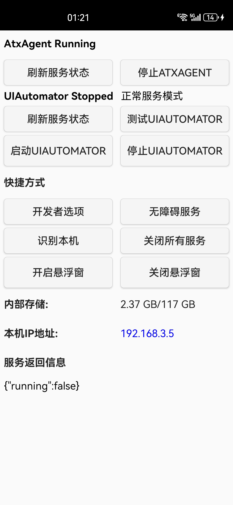

## 学习强国 基于uiautomator2实现的学习助手 免root 适配安卓 自动化脚本

*适配V2.49.0* （平均40分）

- [x] 看文章
- [x] 看视频
- [x] 本地学习(北京)
- [x] 每日答题
- [x] 双人赛/四人赛
- [ ] 挑战答题
- [ ] 订阅
---------------------------
[浅谈自动化测试工具 python-uiautomator2 · TesterHome](https://testerhome.com/topics/11357 "浅谈自动化测试工具 python-uiautomator2 · TesterHome")

## 环境部署

### 安装 adb
安装adb并配置环境变量

这里不做详述，网上的教程很多。安装完查看一下版本信息，能出现具体的版本号说明安装成功

[windows下载安装adb（极其简单）\_adb工具\_x2584179909的博客](https://blog.csdn.net/x2584179909/article/details/108319973 "windows下载安装adb（极其简单）_adb工具_x2584179909的博客")

###  usb调试

usb连手机，手机的【**开发者选项**】里 打开允许【**USB调试**】

cmd 执行 **adb devices**，可以看到设备对应的 序列码，说明已连接上

cmd 执行 **python -m uiautomator2 init**。会在手机上安装两个APK：ATX-agent(小黄车)和 [\`com.github.uiautomator.test\`(](https://github.com/openatx/uiautomator2/blob/0f37aaca07d3f5dcef261308217ce6f4bfc547ef/README.md?plain=1#L1347 "`com.github.uiautomator.test`(  ")不可见)

> 这两个apk使用同一个证书签名的。 不可见的应用实际上是一个测试包，包含有所有的测试代码，核心的测试服务也是通过其启动的。 但是运行的时候，系统却需要那个小黄车一直在运行（在后台运行也可以）。一旦小黄车应用被杀，后台运行的测试服务也很快的会被杀掉。就算什么也不做，应用应用在后台，也会很快被系统回收掉。

### 安装 uiautomator2

[GitHub - openatx/uiautomator2: Android Uiautomator2 Python Wrapper](https://github.com/openatx/uiautomator2#quick-start "GitHub - openatx/uiautomator2: Android Uiautomator2 Python Wrapper")

```python
# Since uiautomator2 is still under development, you have to add --pre to install the development version
pip install --upgrade --pre uiautomator2

# Or you can install directly from github source
git clone https://github.com/openatx/uiautomator2
pip install -e uiautomator2
```


### 连接
设备连接方法，有两种：

python-uiautomator2连接手机的方式有两种，一种是通过WIFI，另外一种是通过USB。两种方法各有优缺点。
WIFI最便利的地方要数可以不用连接数据线，USB则可以用在PC和手机网络不在一个网段用不了的情况。

1) 通过WiFi，假设设备IP 192.168.0.107和您的PC在同一网络中

```python
import uiautomator2 as u2
d = u2.connect('192.168.0.107')
```
2) 通过USB， 假设设备序列是123456789F

```python
import uiautomator2 as u2
d = u2.connect('123456789F') # USB链接设备。或者u2.connect_usb('123456f')
#d = u2.connect_usb() 或者 d = u2.connect() ，当前只有一个设备时可以用这个
```
## 使用说明
部署完成后，运行py文件，在ATX应用上 启动UIAUTOMATOR

